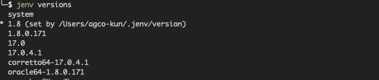

# How to Manage Multiple Java Versions in MacOS 

jenv makes it easy to run multiple versions of Java on a Mac computer. It also makes it easy to seamlessly switch between Java versions when you switch projects. jEnv is a command-line tool to help you forget how to set the JAVA_HOME environment variable.

## Install jEnv

The easiest way to install jEnv is using mac OS package manager **Homebrew**,  To do that simply copy and paste the following command to your terminal:
```bash
brew install jenv
```
Once you installed jEnv into the machine successfully, next you need to add the following to your shells configuration file. Based on the shell you use you need to paste them in the correct file. For bash that would typically be `~/.bash_profile` or `~/.bashrc` , for zsh it's `~/.zshrc`. 

```bash
export PATH="$HOME/.jenv/bin:$PATH"
eval "$(jenv init -)"
```
In order to paste the above lines in your shell configuration file either you can use your text editor (i.e vim, nano, etc) or you can echo as follows to your shell configuration file. You should change the shell configuration file name based on the shell type you use.

```bash
echo 'export PATH="$HOME/.jenv/bin:$PATH"' >> ~/.zshrc
echo 'eval "$(jenv init -)"' >> ~/.zshrc
```

Once you are done with above steps restart your terminal application or resource your configuration. To do that you can use the following command (make sure to change the file name based on your shell type):

```BASH
source ~/.zshrc
```

You should now be able to run `jenv doctor` in terminal to verify your installation of jEnv.

If you see an output similar to above you are in luck. Ignore all the errors and warnings that you see, if you are seeing Jenv is correctly loaded message on your terminal all good for now. But there are a couple of more things you want to do before going to the next step; that’s Run the following commands in the terminal if you are using maven(i.e mvn):

```BASH
# ensure that JAVA_HOME is correct
jenv enable-plugin export
# make Maven aware of the Java version in use (and switch when your project does)
jenv enable-plugin maven
```

Now we are fully configured to use jEnv on our mac, What’s remaining is to install different JDK versions that we wish to switch between. 

## Configuring JDK Versions with jEnv
Now you are at the final step of configuring all the installed JDK versions with jEnv in order to switch between different Java versions. We basically need to tell jEnv where are the JDK versions we want it to manage, that’s what we are going to do in this section.

To do that we need to find all of our JDK root paths. You can hit the following command in the command line to see all the installed JDK versions in your machine.

```BASH
/usr/libexec/java_home -V
```

Now you can add to jEnv each of the JDK you installed by the following command:

```BASH
Syntax: 
jenv add <your_jdk_path>
Example:
jenv add /Library/Java/JavaVirtualMachines/openjdk-14.0.1.jdk/Contents/Home
```

Once you add all the JDKs to jEnv you can list and see whether all the versions you add are available in the jEnv using the following command.

```BASH
jenv versions
```
You can see an input as follows:

 
jEnv is now ready for use in daily development workflows. Few things you want to know before using jEnv.

## Setting system-wide Java version
```BASH
jenv global 14.0
```
## Setting project-wide Java version:
If a specific project needs a different version of Java just hit the following command in the terminal by standing in the directory of that project. jEnv will then create a `.java-version` file that describes which JDK to use for. This file can safely be checked in so that your whole team runs the same version of Java (if using jEnv of course).

```BASH
jenv local 11
```
## Setting shell instance Java version
If you need to run a different version of Java in your shell(i.e terminal window), you can run the following command.

```BASH
jenv shell openjdk64-1.8.0.252
```


**Sources**
* https://github.com/jenv/jenv
* https://blog.bigoodyssey.com/how-to-manage-multiple-java-version-in-macos-e5421345f6d0